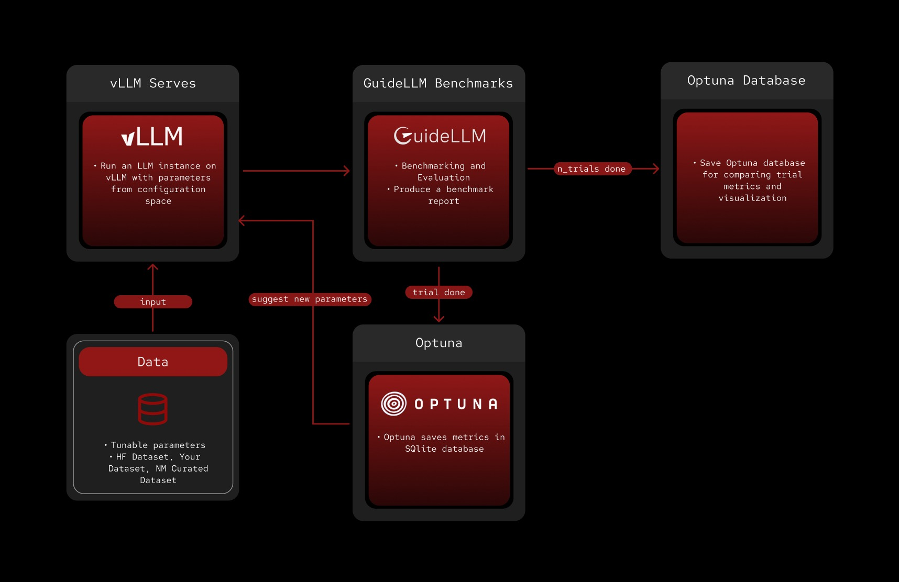

# Auto-tuning vLLM 
**Build Status:** working  
**Python Version:** 3.10+

This project aims to find the best settings for running large language models using vLLM. We want to maximize the number of output tokens/sercond (throughput). At the same time, we will be minimizing the latency under a certain threshold. Specifically we would like to minimize the p95 latency under the default parameters (baseline results). This involves testing different parameters configurations for supported model on huggingface.

## Why is auto-tuning useful?
Auto-tuning is important because it helps us make LLMs work better and faster. By finding the best settings, we can make sure our models respond quickly, which improves the user experience. It also allows us to see which configurations/models can handle more configurations showing us the most efficient way to use LLMs.

## Requirements for Understanding

- Understanding of [vLLM](https://docs.vllm.ai/en/latest/)
- Understanding of [GuideLLM](https://github.com/vllm-project/guidellm)
- Understanding of [Optuna](https://optuna.readthedocs.io/en/stable/)

## Requirements for Running
- Python 3.10+ (**Tested with python 3.12**)
- vLLM server (**Launching LLM models**)
- guidellm (**Benchmarking suite**)
- HuggingFace Hub access (**Model validation**)
- NVIDIA GPU with CUDA support (**System tested on dual L40S**)

## How does the System Run
The project operates by serving a Large Language Model with vLLM and evaluating their performance using GuideLLM. This entire process is repeated for **N** number of trials which is manage through an Optuna study, with all the data getting saved into a SQLite database located at `src/studies/study_n/optuna.db`. The parameters for vLLM are defined in the `vllm_config.yaml` file, which allows users to easily add new parameters or change existing values without neeting to modify the code.



## How to Run

To run the program, use the `main.py` script with specific arguments to define optimization mode, LLM and other benchmarking details you would like to use. Example command:

```bash
python -m src.serving.main --mode config --model "Qwen/Qwen3-30B-A3B-FP8" --max-seconds 600 --prompt-tokens 8000 --output-tokens 2000 --n-trials 300
```

### Command Line Arguments

- `--mode`: This argument specifies the optimization approach:
  - `p95_latency`: Focuses just on minimizing P95 latency
  - `config`: Uses the configuration file settings (recommended)
- `--model`: Specifies the large language model to be used for testing (default: `Qwen/Qwen3-32B-FP8`)
- `--dataset`: Dataset for GuideLLM: HuggingFace dataset ID, local path to dataset file (CSV, JSONL, etc.), or leave empty to use synthetic data
- `--max-seconds`: Duration for each trial in seconds (default: 240)
- `--prompt-tokens`: Number of prompt tokens for synthetic data (default: 1000)
- `--output-tokens`: Number of output tokens for synthetic data (default: 1000)
- `--n-trials`: Number of optimization trials (overrides config file setting)

When using `--mode config`, you can choose between:
- `single_objective`: Maximize throughput only
- `multi_objective`: Find Pareto-optimal throughput vs latency trade-offs

## Search Space

Currently we are exploring the following parameters, which are defined in the `vllm_config.yaml` file, to help us find the best performance:

### vLLM Server Parameters
- **max_num_batched_tokens**: Maximum tokens processed in a single batch (8192, 16384)
- **compilation_config**: Compilation optimization level (0, 3)
- **block_size**: Memory block size for attention (8, 16, 32, 64, 128)
- **kv_cache_dtype**: Key-value cache data type ("auto", "fp8", "fp8_e5m2", "fp8_e4m3")
- **gpu_memory_utilization**: GPU memory usage ratio (0.90 to 0.95 in 0.01 steps)
- **cuda_graph_sizes**: CUDA graph capture sizes (8 to 16384 in steps of 64)
- **long_prefill_token_threshold**: Threshold for long prefill tokens (0, 256, 512, 1024, 2048, 4096, 8192)
- **max_seq_len_to_capture**: Maximum sequence length for CUDA graphs (4096, 8192, 16384)
- **max_num_partial_prefills**: Maximum partial prefill operations (1, 2, 4, 8)

### GuideLLM Benchmarking Parameters
- **guidellm_concurrency**: Number of concurrent requests (10 to 240 in steps of 10)

## How to Add Unlisted Parameters

You can add new parameters to the `vllm_config.yaml` file by defining them with a specific structure. Each parameter block should include a name, an enabled flag, and either a `range` or `options` field to specify its possible values.

### Parameter Definition Examples

**Range-based parameters** (for continuous numerical values):
```yaml
cuda_graph_sizes:
  name: "cuda-graph-sizes"
  enabled: true
  range:
    start: 8
    end: 16384
    step: 64
```

**Options-based parameters** (for discrete predefined values):
```yaml
long_prefill_token_threshold:
  name: "long-prefill-token-threshold"
  enabled: true
  options: [0, 256, 512, 1024, 2048, 4096, 8192]
```

### Field Descriptions
- **name**: The actual command-line argument name for vLLM (e.g., `"--cuda-graph-sizes"`)
- **enabled**: Set to `true` to include the parameter in optimization, `false` to disable it
- **range**: Used for numerical parameters with continuous values
  - **start**: Minimum value for the parameter
  - **end**: Maximum value for the parameter
  - **step**: Increment between values within the range
- **options**: Used for parameters with discrete predefined values (list format)

## Objective Functions

The system supports three different optimization approaches, each with its own objective function:

### 1. Single Objective (`single_objective`)
- **Goal**: Maximize throughput (output tokens per second)
- **Use Case**: When you want the highest possible throughput regardless of latency
- **Metrics**: Returns only throughput value
- **Result**: Single best configuration for maximum throughput

### 2. Multi Objective (`multi_objective`)
- **Goal**: Find Pareto-optimal trade-offs between throughput and latency
- **Use Case**: When you need to balance performance and responsiveness
- **Metrics**: Returns both throughput (maximize) and latency (minimize)
- **Result**: Set of Pareto-optimal solutions showing different throughput/latency trade-offs

### 3. P95 Latency (`p95_latency`)
- **Goal**: Minimize P95 latency while staying under baseline threshold
- **Use Case**: When latency consistency is critical (e.g., real-time applications)
- **Metrics**: Returns P95 latency value
- **Result**: Configuration with the lowest P95 latency under acceptable limits

### Optimization Configuration

The objective function approach is configured in `vllm_config.yaml`:

```yaml
optimization:
  approach: "multi_objective"  # or "single_objective"
  n_trials: 200
  sampler: "botorch"  # ["botorch", "nsga2", "tpe", "random", "grid"]
```

The system uses Optuna for optimization with support for various samplers including Bayesian optimization (BoTorch), evolutionary algorithms (NSGA-II), and traditional methods (TPE, Random, Grid Search).

## Samplers

The system supports multiple optimization samplers, each with different strengths and use cases. The sampler is configured in `vllm_config.yaml` under the `optimization.sampler` field.

### Available Samplers

#### 1. **BoTorch** (`"botorch"`)
- **Algorithm**: Bayesian Optimization using Gaussian Processes
- **Best For**: Complex optimization landscapes with expensive evaluations
- **Characteristics**:
  - Uses machine learning to model the objective function
  - Balances exploration vs exploitation intelligently
  - Requires 20 startup trials for initial model training
  - Excellent for finding global optima with fewer trials

#### 2. **NSGA-II** (`"nsga2"`)
- **Algorithm**: Non-dominated Sorting Genetic Algorithm II
- **Best For**: Multi-objective optimization problems
- **Characteristics**:
  - Finds Pareto-optimal solutions efficiently
  - Handles multiple conflicting objectives naturally
  - Good exploration of trade-off frontiers
- **Recommended For**: Multi-objective optimization (throughput vs latency)

#### 3. **TPE** (`"tpe"`) - *Default*
- **Algorithm**: Tree-structured Parzen Estimator
- **Best For**: General-purpose optimization with moderate trial budgets
- **Characteristics**:
  - Probabilistic model-based optimization
  - Good balance of exploration and exploitation
  - Reliable performance across various problem types
  - Lower computational overhead than BoTorch
- **Recommended For**: Standard optimization tasks, single objective

#### 4. **Random** (`"random"`)
- **Algorithm**: Uniform random sampling
- **Best For**: Baseline comparisons and simple exploration
- **Characteristics**:
  - No learning from previous trials
  - Uniform coverage of search space
  - Minimal computational overhead
  - Useful for establishing baselines

#### 5. **Grid** (`"grid"`)
- **Algorithm**: Exhaustive grid search
- **Best For**: Small search spaces requiring complete coverage
- **Characteristics**:
  - Tests all possible parameter combinations
  - Guarantees finding the optimal solution in discrete spaces
  - Number of trials = product of all parameter options
  - Can be computationally expensive for large spaces


